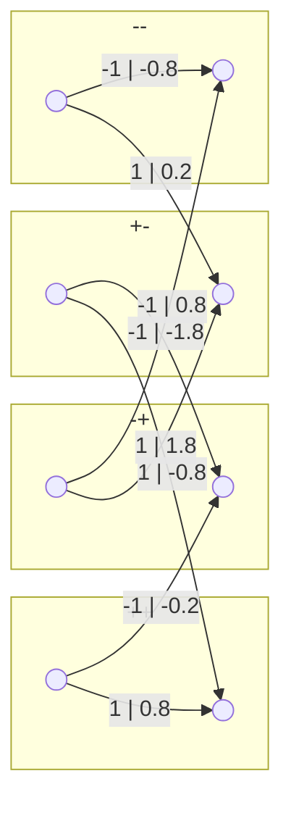
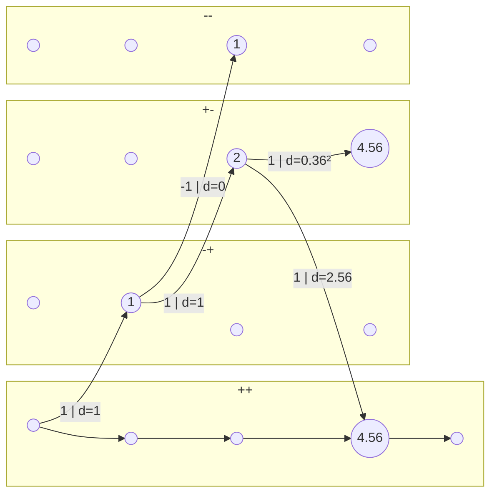
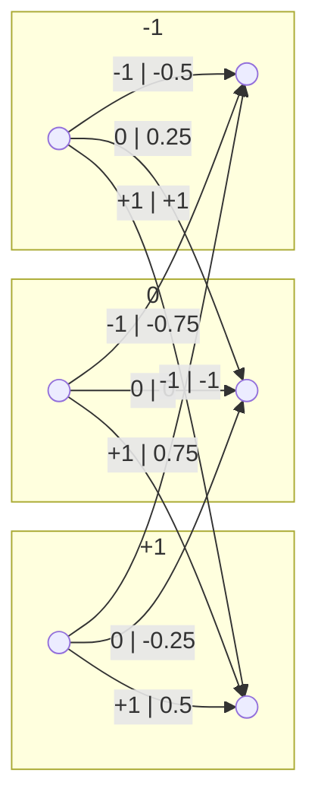
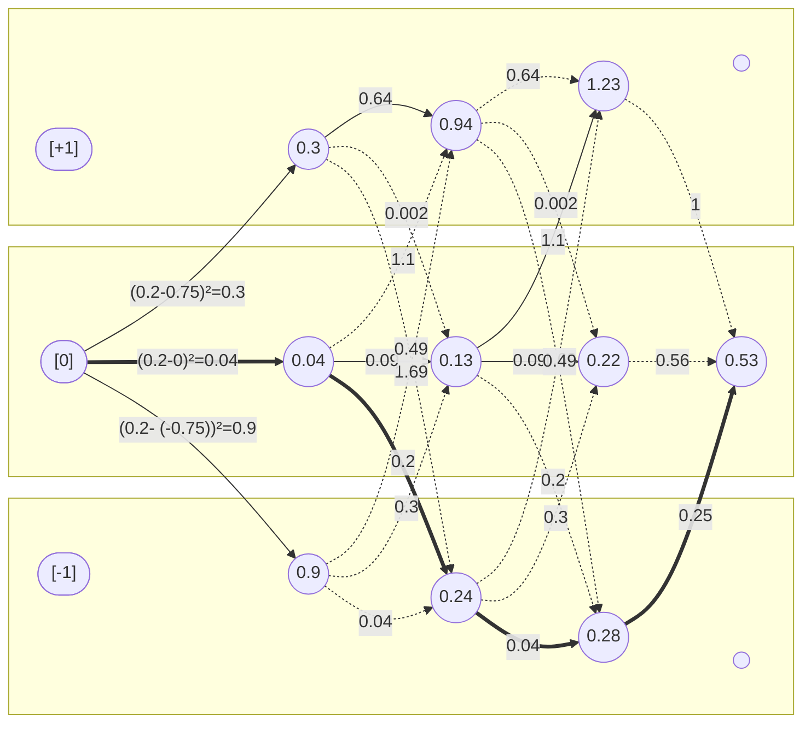
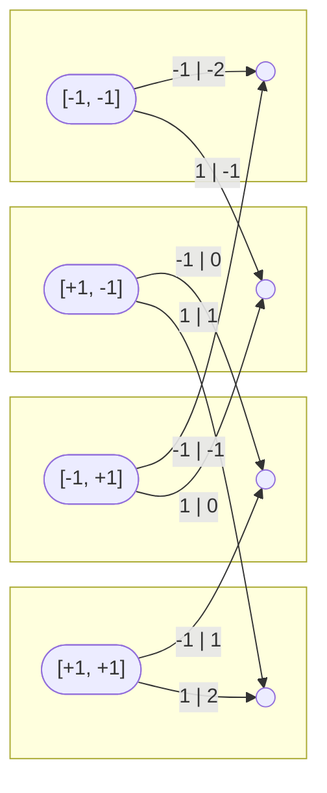
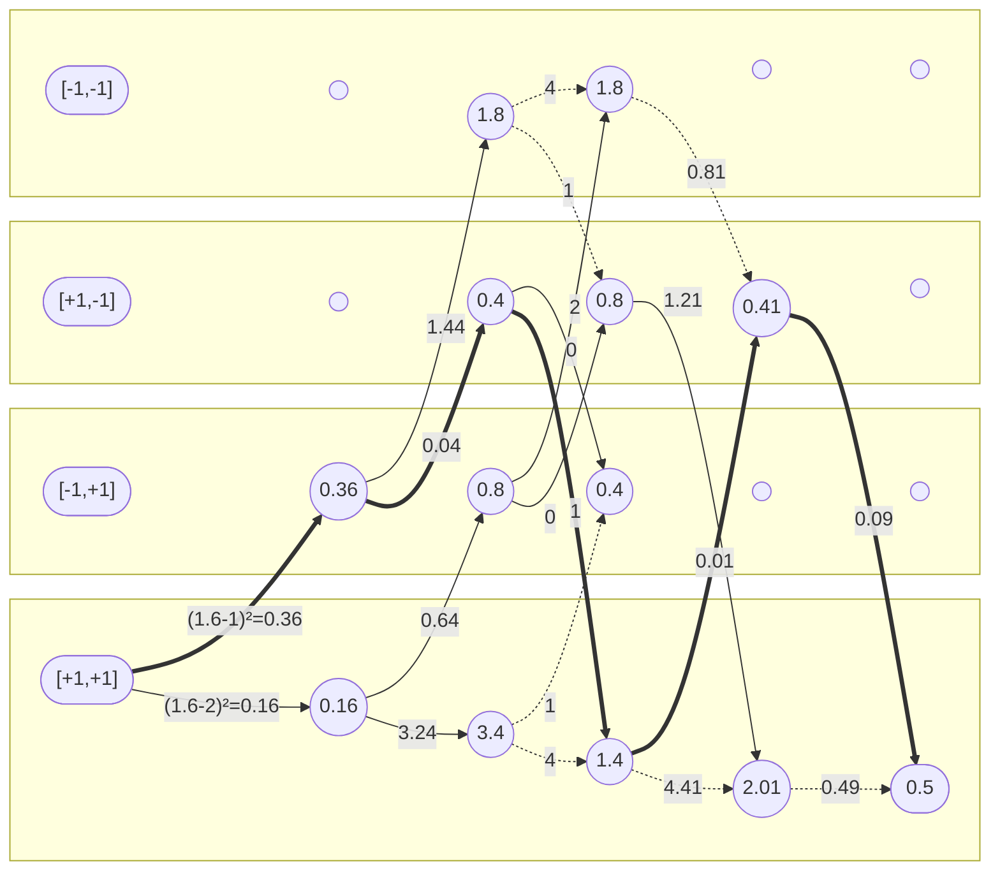

## Digital Communications

# Chapter 3 Exercises

*Academic year 2024-2025*  

---

## Exercise 1

Consider to transmit a binary symbol constellation $\{1, +1\}$ through the
channel $p[n] = 0,5[n] 0,5[n - 1] + 0,8[n - 2]$.

### Question 1.1

Draw the trellis diagram labeling each branch with the corresponding metric.

Now, to find the minimum distance. Let's choose all 1's as our reference
sequence.

The only path back into the reference line goes through the `+-` node, and the
cost to get back is $2.56$. Since all other paths will have to use this link at some point, if their cost is higher than $4.56 - 2.56 = 2$, we can discard them.

The final node has a cost of $3.92$. Note that $D_{min}$ is the square root of
this value:

$$
D_{min} = \sqrt{3.92} = 1.98
$$

### Question 1.2

Determine the minimum distance Dmin.

## Exercise 3

A 4-PSK constellation, with equiprobable symbols $A[n] \in {+1, 1, +j, j}$ and
$E_s = 1$, is transmitted through the following equivalent discrete channel

$$
p[n] = [n] + j0.8[n - 1]
$$

with additive Gaussian white noise. The goal is to evaluate the performance of
the system with di↵erent receivers.

### Question 3.a)
If in the receiver there is a memoryless symbol by symbol detector

#### Section 3.a.i)

Obtain the received constellation without noise in the channel.

> **Answer**

| $A[n]$ | $A[n-1]$ | $o[n] = A[n] + j 0.8 A[n-1]$ |
| :----: | :------: | ---------------------------- |
| $1$    | $1$      | $1+j0.8$                     |
| $1$    | $-1$     | $1-j0.8$                     |
| $1$    | $j$      | $1-0.8 = 0.2$                |
| $1$    | $-j$     | $1+0.8 = 1.8$                |
| $-1$   | $1$      | $-1+j0.8$                    |
| $-1$   | $-1$     | $-1-j0.8$                    |
| $-1$   | $j$      | $-1-0.8 = -1.8$              |
| $-1$   | $-j$     | $-1+0.8 = -0.2$              |
| $j$    | $1$      | $j+j0.8 = 1.8j$              |
| $j$    | $-1$     | $j-j0.8 = 0.2j$              |
| $j$    | $j$      | $j-0.8 = -0.8 + j$           |
| $j$    | $-j$     | $j+0.8 = 0.8 + j$            |
| $-j$   | $1$      | $-j+j0.8 = 0.2j$             |
| $-j$   | $-1$     | $-j-j0.8 = -1.8j$            |
| $-j$   | $j$      | $-j-0.8 = 0.8 - j$           |
| $-j$   | $-j$     | $-j+0.8 = -0.8 - j$          |

#### Section 3.a.ii)

Calculate the probability of error Pe.

> **Answer**
>
> 0.28

The symbol-by-symbol detector will decide on distance, since the noise is white

### Question 3.b)
If the receiver is composed by a linear equalizer using the ZF criterion (without constrains in its complexity) and then a symbol by symbol detector

#### Section 3.b.i)

Obtain the transfer function of the equalizer.

#### Section 3.b.ii)

Estimate Pe.

### Question 3.c)
If the receiver is a ML (maximum likelihood) detector of sequences:

#### Section 3.c.i)

Obtain the trellis diagram and the minimum distance to an erroneous event.

#### Section 3.c.ii)

Obtain Pe and compare with the probabilities of error previously obtained.

## Exercise 4

### Question 4.c)

> **Answer**
>
> $$D_{min} = 0.79$$

### Question 4.d)

Decode the following sequence

$$
\bar{q} = \{0.2, -0.3, -0.3, 0.75\}
$$

using a a ML detector. Assume that $A[n] = 0$ for $n < 0$ and $n ≥ 3$

> **Answer**

Now we can build the trellis diagram for the sequence

## Exercise 13

$$
p[n] = 0.5 δ[n] + δ[n-1] + 0,5 δ[n-2]
$$

$$
A[n] = ±1
$$

### Question 13.6

$$
A[-2], A[-1], A[3], A[4] = 1, 1, 1, 1
$$

$$
\bar{q} = \{1.6, 0.2, 0, -0.1, 1.3\}
$$

> **Answer**

Transitions:

Sequence:

