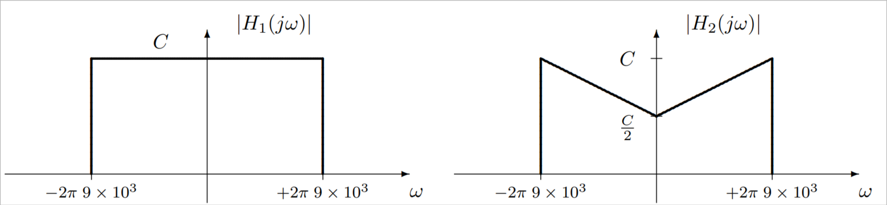

## Digital Communications

# Chapter 2: Linear modulations - Exercises

*Academic year 2024-2025*  

---

## Exercise 3

A 2-PAM constellation is transmitted through the equivalent discrete channel $p[n] = δ[n]+
0.25·δ[n-1]$. The noise is white, Gaussian, with variance $σ_z^2$ . Calculate the exact expression
of the probability of error with a memoryless symbol-by-symbol detector

> **Answer**
>
> ```mermaid
> %%{init: {'forceLegacyMathML':'true'} }%%
> graph LR
> A(("$$A[n]$$"))
> ch["$$p[n]$$"]
> noise(("$$z[n]$$")) --> sum("&plus;")
> dec["Decisor"]
> A_(("$$\hat{A}[n]$$"))
> 
> A --> ch -- "o[n]" --> sum -- "q[n]" --> dec --> A_
> ```
>
> First, we'll compute $P_e$ assuming $p[n] = δ[n]$
>
> We'll assume symbols are equally likely, so we'll use the proximity rule:
>
> * $q[n] ≥ 0 ⇒ \hat{A}[n] = 1$
> * $q[n] < 0 ⇒ \hat{A}[n] = -1$
>
> Since noise is gaussian, the probability of error is given by:
>
> $$
> \begin{aligned}
>     P_e &= P(A_n=1) · P(\hat{A}_n=-1 | A_n=1) + P(A_n=-1) · P(\hat{A}_n=1 | A_n=-1) \\
>     &= \frac{1}{2} · \left(Q\left(\frac{1}{σ_z}\right) + Q\left(\frac{1}{σ_z}\right)\right) \\
>     &= Q\left(\frac{1}{σ_z}\right)
> \end{aligned}
> $$
>
> However, our $p[n]$ is not a simple delta, so we'll first compute $o[n]$.
>
> $$
> o[n] = A[n] * p[n] = A[n] * (δ[n] + 0.25 δ[n-1]) = A[n] + 0.25 A[n-1]
> $$
>
> Given all combinations of $A[n]$ and $A[n-1]$, the possible values of $o[n]$ are:
>
> | $A[n]$ | $A[n-1]$ | $o[n]$ |
> | :----: | :------: | :----: |
> | 1      | 1        | 1.25   |
> | 1      | -1       | 0.75   |
> | -1     | 1        | -0.75  |
> | -1     | -1       | -1.25  |
>
> As we can see, the new constellation now has 4 symbols. Luckily, we can use the same decision
> regions as before. We'll now compute the new $P_e$. We'll go case by case:
>
> $$
> \begin{aligned}
>     P_e |_{A[n]=1} &= Q\left(\frac{0.75}{σ_z}\right) + Q\left(\frac{1.25}{σ_z}\right) \\
>     P_e |_{A[n]=-1} &= Q\left(\frac{|-0.75|}{σ_z}\right) + Q\left(\frac{|-1.25|}{σ_z}\right) \\
> \end{aligned}
> $$
>
> The overall $P_e$ is the average of both cases, as symbols are still assumed to be equally likely.
>
> $$
> \begin{aligned}
>     P_e &= \frac{1}{2} \left(P_e |_{A[n]=1} + P_e |_{A[n]=-1}\right) \\
>     &= Q\left(\frac{0.75}{σ_z}\right) + Q\left(\frac{1.25}{σ_z}\right) \\
> \end{aligned}
> $$
>
> As we can see, the probability of error is higher than before, when we assumed there was no ISI.
> That's why we usually try to avoid ISI like the plague.
>
> **Bonus**: As $p[n]$ has non-zero values outside of $n = 0$, there is ISI.
>

## Exercise 7

A baseband communication system uses a BPSK constellation, $A[n] ∈ [±1]$, and the following shaping
filter:

$$
g(t) = \begin{cases}
    \frac{1}{\sqrt{T}} & -T/2 < t < 0 \\
    -\frac{1}{\sqrt{T}} & 0 < t < T/2 \\
    0 & \text{otherwise}
\end{cases}
$$

The modulated signal is transmitted through a linear channel with impulse response

$$
h(t) = δ(t) + δ(t-T/2)
$$

and the receiver uses a matched filter. Noise at the input of the receiver is white, Gaussian, with
power spectral density $N_0/2$ W/Hz

### Question 7.a
Calculate the equivalent discrete channel $p[n]$

> **Answer**
>
> In order to find $p[n]$, we'll find $p(t)$ first.
>
> $$
> \begin{aligned}
>     p(t) &= g(t) * h(t) * f(t) \\
>     &= g(t) * g(-t) * h(t) \\
>     &= α(t) * h(t) \\
> \end{aligned}
> $$
>
> We'll compute $α(t)$ first. This can be computed graphically to obatain:
>
> $$
> α(t) = \begin{cases}
>     -1 + \frac{|t|}{T} & \text{if } 0.5 T ≤ |t| ≤ T \\
>     1 - 3\frac{|t|}{T} & \text{if } 0 ≤ |t| ≤ 0.5 T \\
>     0 & \text{otherwise}
> \end{cases}
> $$
>
> Now, $p(t)$ can be computed graphically and sampled to obtain $p[n]$.

#### Question 7.a.2
Is there ISI?

> **Answer**
>
> We only need to take one iteration of the shifted sum to deduce whether or not there is ISI.
>
> Let's take $p(t) = α(t) + α(t - T)$ and sample it at $t = 0$ and $t = T$. We obtain that $p[0] =
> 0.5$ and $p[T] = -0.5$. This means that there is ISI.

### Question 7.b
Obtain the power spectral density of the discrete time noise $z[n]$ present at the output of the
sampler at the receiver, explaining the procedure to obtain the result.

> **Answer**
>
> $$
> z[n] = n(t) * f(t) \big|_{t = nT}
> $$
>
> $$
> S_z(e^{jω}) = \frac{N_0}{2}\frac{1}{T} ∑_k \left|F\left(\frac{ω}{T} - j\frac{2π}{T}k\right)\right|^2
> $$
>
> Our most important goal is to find out whether or not the output noise is white. We'll have to check
> whether the sum part of the expression is constant. Sice we are starting from $f(t)$, one way of
> doing this would be to find $F(jω) = \mathcal F \{f(t)\}$, find the sum of the shifts and check
> that.
>
> However, we can also use a certain fact of this shifted sum:
>
> $$
> \mathcal F \left\{∑_k \left|F\left(\frac{ω}{T} - j \frac{2π}{T}k\right)\right|^2\right\}
> = \left(f(t) * f(-t)\right) · ∑_k δ(t - kT)
> $$
>
> We'll calculate the right side of this
>
> This expression is similar to the Nyquist criteria expressed in the Frequency Domain, and we can use
> this fact to check this condition using one of the other equivalent expressions.
>
>
> We'll do the convolution $α(t) = g(t) * f(t)$ and then sample it at $t = nT$, to check the Nyquist
> criteria.
>
> <!-- TODO: Check this! -->
>
> $$
> α(t) = g(t) * g(-t) = \begin{cases}
>     1 - 3\frac{|t|}{T} & \text{if } 0 ≤ |t| ≤ 0.5 T \\
>     -1 + \frac{|t|}{T} & \text{if } 0.5 T ≤ |t| ≤ T \\
>     0 & \text{otherwise}
>     \end{cases}
> $$
>
> When sampled, that's a delta, so the noise is indeed white

### Question 7.c
Calculate the probability of error $P_e$

> **Answer**
>
> ```mermaid
> %%{init: {'forceLegacyMathML':'true'} }%%
> graph LR
> A(("$$A[n]$$"))
> ch["$$p[n]$$"]
> noise(("$$z[n]$$")) --> sum(("&plus;"))
> dec["Decisor"]
> 
> A_(("$$\hat{A}[n]$$"))
> 
> A --> ch -- "o[n]" --> sum -- "q[n]" --> dec --> A_
> ```
>
> We need to find $o[n] = A[n] * p[n]$. We already know $p[n]$.
>
> $$
> o[n] = A[n] * p[n] = A[n] * (0.5δ[n] - 0.5δ[n-1]) = 0.5A[n] - 0.5A[n-1]
> $$
>
> We'll build a table to find the possible values of $o[n]$:
>
> | $A[n]$ | $A[n-1]$ | $o[n]$ |
> | :----: | :------: | :----: |
> | 1      | 1        | 0      |
> | 1      | -1       | 1      |
> | -1     | 1        | -1     |
> | -1     | -1       | 0      |
>
> This looks awful: there are two possibilities for which $o[n] = 0$. This means that the decision
> will not have any reliability in those cases.
>
> The best decision regions are given by the proximity rule:
>
> * $o[n] > 0 ⇒ \hat{A} [n] = 1$
> * $o[n] < 0 ⇒ \hat{A} [n] = -1$
>
> $$
> P_e \big|_{A[n] = 1} = \frac12 Q\left(\frac0σ\right) + \frac12 Q\left(\frac1σ\right)
> $$
>
> Explointing symmetry:
>
> $$
> P_e \big|_{A[n]=-1} = \frac14 + \frac12 Q\left(\frac1σ\right)
> $$
>
> The total $P_e$ is the weighted sum of both. Since both symbols are equally likely:
>
> $$
> P_e = \frac12 · P_e \big|_{A[n]=1} + \frac12 · P_e \big|_{A[n]=-1}
> $$

## Exercise 8

A baseband transmission system sends the modulated signal through one of these
channels. The receiver filter will be matched to the transmitter filter.



### Question 8.a

Design for Channel 1 the shaping filters at the transmitter and receiver in
order to get no ISI and the noise at the output of the sampler be white.

> **Answer**
>
> As studied, the optimal shaping filter for this baseband channel is a raised
> cosine filter. It will also ensure the noise is white.

### Question 8.b

Design for Channel 2 the shaping filters at the transmitter and receiver in
order to get no ISI.

> **Answer**
>
> $$
> |H_2(jω)| = \begin{cases}
>     \frac{C}{2} + \frac{C|ω|}{2W} & |ω| < W \\
>     0 & \text{otherwise}
> \end{cases}
> $$
>
> Where $W = 2π ⋅ 9 ⋅ 10^3$
>
> This channel's frequency response is more complicated, but we can make it
> work. Let's check the Nyquist criteria for zero ISI in the frequency domain
>
> $$
> \frac{1}{T} ∑_k P\left(jω - \frac{2π}{T} k\right) = \text{const}
> $$
>
> Where
>
> $$
> P(jω) = |G(jω) ⋅ H(jω) ⋅ F(jω)|^2
> $$
>
> Given that we're using matched filters, this can be rewritten as
>
> $$
> \begin{aligned}
>     P(jω) &= G(jω) ⋅ H(jω) ⋅ G^*(jω) \\
>     &= |G(jω)|^2 H(jω)
> \end{aligned}
> $$
>
> And since we want $P(jω)$ to be a raised cosine, we can find $G(jω)$ as
>
> $$
> G(jω) = \sqrt{\frac{P(jω)}{H(jω)}}
> $$
>
> Where $P(jω)$ has a raised cosine shape.

### Question 8.c

Design for Canal 2 the shaping filters at the transmitter and receiver in order
to get white noise at the output of the sampler.

> **Answer**
>
> In order to get white noise at the output of the sampler, we just need to
> ensure that its PSD after the matched filter and periodic sampling stays
> constant. This can be achieved by using a raised cosine filter as the shaping
> filter and matching it at the receiver. This will ensure that the noise is
> white, but there will inevitably be ISI.

### Question 8.d

Get the maximum symbol rate in both channels

## Exercise 11

A communication system uses a squared-root raised cosine filter (SR-RCF) in the transmitter for a
baseband PAM modulation with roll-off factor $α$. In the receiver there is a matched filter to the
transmitter. Assume that the channel is AWGN with an impulse response $h(t)$ and noise PSD $N_0/2$.
The channel bandwidth is 4 kHz

### Question 11.a
Show if the sampled noise at the output of the matched filter is white.

> **Answer**
>
> We'll check the PSD of $z[n]$
>
> $$
> S_z(e^{jω}) = \frac{N_0}{2} \frac1T ∑_k \left|F\left(\frac{ω}{T} - j\frac{2π}{T}k\right)\right|^2
> $$
>
> As the given $|F(jω)|^2$ is a raised cosine, we already know for a fact that its shifted sum is
> constant, so the noise is white.

### Question 11.b
Get the maximum symbol transmission rate without ISI and get the roll-off factor needed for this
rate.

> **Answer**
>
> $$
> W = \frac{π}{T} (1+α) = 2π 4·10^3 ⇒ R_s = \frac{8 ·10^3}{1+α}
> $$
>
> The best symbol rate will be achieved with a roll-off factor $α=0$:
>
> $$
> R_s^{max} = \frac{8·10^3}{1+0}= 8·10^3 \text{ symbols per second}
> $$

### Question 11.c
For the roll-off factor obtained in previous item, draw the PSD of the transmitted signal in these
two cases:

#### Case 11.c.i
Sequence $A[n]$ is white with mean symbol energy $E_s$.

> **Answer**
>
> The PSD of a white sequence is a constant, and the mean symbol energy is the exact same as its PSD.
>
> ```mermaid
> %%{init: {'forceLegacyMathML':'true'} }%%
> graph LR
> A(("$$A[n]$$"))
> mod["$$g(t)$$"]
> s(("$$s(t)$$"))
> 
> A --> mod --> s
> ```
>
> $$
> S_s(jω) = \frac{1}{T} S_A(e^{jωT}) · |G(jω)|^2 = \frac{Es}{T} |G(jω)|^2
> $$
>
> Where we know $|G(jω)|^2$ because it's a SR-RCF with roll-off factor $α=0$: a perfect bandlimited
> filter of bandwidth $\frac{π}{T}$ and amplitude $T$
>
> $$
> S_s(jω) = \begin{cases}
>     E_s & |ω| < \frac{π}{T} \\
>     0 & \text{otherwise}
> \end{cases}
> $$

#### Case 11.c.ii
Sequence $A[n]$ has a PSD $S_A(e^{jω})=1+ \cos(ω)$.

> **Answer**
>
> $$
> S_A(e^{jωT}) = 1 + \cos(ωT)
> $$
>
> $$
> S_A(e^{jωT}) \big|_{ω=\frac{π}{2T}} = 1+ \cos \frac{π}{2} \\
> S_A(e^{jωT}) \big|_{ω=0} = 1+ \cos 0 \\
> S_A(e^{jωT}) \big|_{ω=\frac{π}{T}} = 0
> $$
>
> We can use those to build an approximate curve of the PSD of the transmitted signal.

### Question 11.d
If the roll-off factor used is $α = 0.25$ transmitting at the maximum symbol rate possible without
ISI, get the number of symbols $M$ needed to get a binary rate of $19200$ bits per second.

> **Answer**
>
> The bandwidth is still the same:
>
> $$
> R_s = \frac{8·10^3}{1.25} = 6400 \text{ symbols per second}
> $$
>
> The relationship between the symbol rate and the bit rate is:
>
> $$
> R_b = R_s \log_2 M
> $$
>
> And then we'll solve for $M$:
>
> $$
> M = 2^{R_b/R_s} = 2^{19200/6400} = 2^3 = 8
> $$
