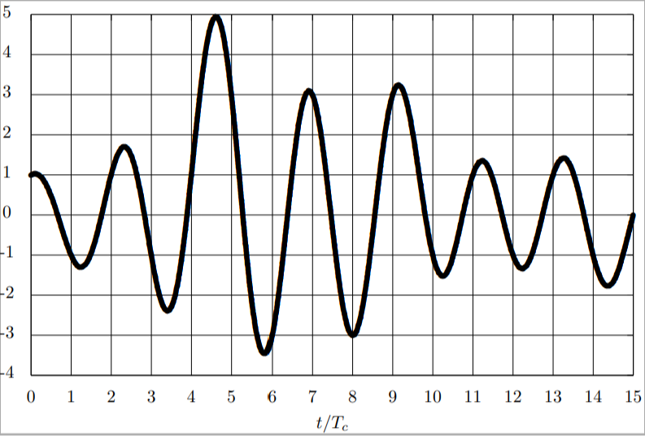

## Digital Communications <!-- omit in toc -->

# Chapter 5 Exercises

*Academic year 2024-2025*  

---

### Table of Contents

* [Exercise 1 ✓](#exercise-1-)
    * [Question 1.a ✓](#question-1a-)
    * [Question 1.b ✓](#question-1b-)
* [Exercise 2](#exercise-2)
    * [Question 2.1 ✓](#question-21-)
    * [Question 2.2](#question-22)
    * [Question 2.3](#question-23)
* [Exercise 4](#exercise-4)
    * [Question 4.a ✓](#question-4a-)
    * [Question 4.b ✓](#question-4b-)
    * [Question 4.c](#question-4c)
* [Exercise 5](#exercise-5)
    * [Question 5.a](#question-5a)
    * [Question 5.b](#question-5b)
    * [Question 5.c](#question-5c)

---

## Exercise 1 ✓

Consider a discrete time OFDM modulation with N = 4 carriers.

### Question 1.a ✓

Assuming that cyclic prefix is not used, find the conditions in order to avoid
ICI and ISI.

> **Answer** (class notes)
>
> This is only possible if the channel is $d[m] = δ[m]$

### Question 1.b ✓

Using a cyclic prefix of length $C = 2$, and assuming that the discrete channel
at sampling time $T /(N + C)$ is $d[m] = δ[m] + \frac{1}{3} δ[m - 2]$, obtain
the discrete equivalent channels $p_{k,i}[n]$. From this result, discuss and
explain whether there is ICI and ISI or not.

> **Answer** (class notes)
>
> If we correctly use the cyclic prefix, the channel would be
>
> $$
> p_{k,i}[n] = \frac{N}{T} δ[n] δ[k-i] D[k]
> $$
>
> Where $D[k]$ is a scaling factor defined as
>
> $$
> \begin{aligned}
>     D[k] &= \mathrm{DFT} \{d[m]\} \\
>     &= \sum_{m=0}^{N-1} d[m] e^{-j \frac{2π}{N} m k} \\
>     &= 1 + \frac{1}{3} e^{-j \frac{2π}{4} 2 k} \\
>     &= 1 + \frac{1}{3} e^{-j π k} \\
> \end{aligned}
> $$
>
> Therefore, the discrete equivalent channel is
>
> $$
> \begin{aligned}
>     p_{k,i}[n] &= \begin{cases}
>         \frac{N}{T} δ[n] D[0] & \text{if } k = i = 0 \\
>         \frac{N}{T} δ[n] D[1] & \text{if } k = i = 1 \\
>         \frac{N}{T} δ[n] D[2] & \text{if } k = i = 2 \\
>         \frac{N}{T} δ[n] D[3] & \text{if } k = i = 3 \\
>         0 & \text{otherwise}
>     \end{cases} \\
>     &= \begin{cases}
>         \frac{4}{T} δ[n] (1 + \frac{1}{3}) & \text{if } k = i = 0 \\
>         \frac{4}{T} δ[n] (1 + \frac{1}{3} e^{-j π}) & \text{if } k = i = 1 \\
>         \frac{4}{T} δ[n] (1 + \frac{1}{3} e^{-j 2π}) & \text{if } k = i = 2 \\
>         \frac{4}{T} δ[n] (1 + \frac{1}{3} e^{-j 3π}) & \text{if } k = i = 3 \\
>         0 & \text{otherwise}
>     \end{cases} \\
>     &= \begin{cases}
>         \frac{4}{T} \frac{4}{3} δ[n] & \text{if } k = i = 0 \\
>         \frac{4}{T} \frac{2}{3} δ[n] & \text{if } k = i = 1 \\
>         \frac{4}{T} \frac{4}{3} δ[n] & \text{if } k = i = 2 \\
>         \frac{4}{T} \frac{2}{3} δ[n] & \text{if } k = i = 3 \\
>         0 & \text{otherwise}
>     \end{cases}
> \end{aligned}
> $$

## Exercise 2

Consider an OFDM modulation with $N = 4$ carriers and a cyclic prefix of 2
samples. Each carrier is modulated with equiprobable QPSK symbols. Moreover,
assume the following equivalent discrete channel, sampled at time $T/6$

$$
d[m] = δ[m] - 0,6δ[m - 1]
$$

with additive Gaussian complex white noise (the variance is $N_0$). In the
receiver, a ML decoder, designed for a QPSK modulation, is used.

### Question 2.1 ✓

Obtain the equivalent discrete channels $p_{k,i}[n]$ corresponding to the 16
sub-channels.

> **Answer** (class notes)
>
> We can obtain the equivalent discrete channels by using the formula
>
> $$
> p_{k,i}[n] = \frac{N}{T} δ[n] δ[k-i] D[k]
> $$
>
> Where
>
> $$
> \begin{aligned}
> D[k] &= \mathrm{DFT} \{d[m]\} \\
> &= 1 - 0.6 e^{-j \frac{2π}{4} k} \\
> \end{aligned}
> $$
>
> Substituting:
>
> $$
> \begin{aligned}
>     p_{k,i}[n] &= \begin{cases}
>         \frac{N}{T} δ[n] D[0] & \text{if } k = i = 0 \\
>         \frac{N}{T} δ[n] D[1] & \text{if } k = i = 1 \\
>         \frac{N}{T} δ[n] D[2] & \text{if } k = i = 2 \\
>         \frac{N}{T} δ[n] D[3] & \text{if } k = i = 3 \\
>         0 & \text{otherwise}
>     \end{cases} \\
>     &= \begin{cases}
>         \frac{4}{T} 0.4 δ[n] & \text{if } k = i = 0 \\
>         \frac{4}{T} (1 + j0.6) δ[n] & \text{if } k = i = 1 \\
>         \frac{4}{T} (1 - j0.6) δ[n] & \text{if } k = i = 2 \\
>         \frac{4}{T} 1.6 δ[n] & \text{if } k = i = 3 \\
>         0 & \text{otherwise}
>     \end{cases} \\
> \end{aligned}
> $$

### Question 2.2

Obtain the SNR for each carrier.

> **Answer** (class notes)
>
> Solve using the following formula
>
> $$
> SNR = \frac{\left(\frac{N}{T}\right)^2 |D[k]|^2 E_s}{σ_z^2}
> $$

### Question 2.3

Determine the probability of error per carrier and the mean probability of error

> **Answer** (class notes)
>
> Solve using the following formula
>
> $$
> \begin{aligned}
>     P_e^{(k)} ≈ Q\left(\frac{\frac{N}{T}|D[k]| d_{min}^{A[n]}}{2σ_z}\right)
> \end{aligned}
> $$

## Exercise 4

A communication system uses a direct sequence spread spectrum modulation with
spreading factor N = 4, and spreading sequence $x[0] = +1$, $x[1] = -1$, $x[2] =
+1$ and $x[3] = -1$. The transmitter filter at chip time $g_c(t)$ is a
root-raised cosine pulse with roll-off factor $α = 0.25$. In the receiver a
matched filter to $g_c(t)$ is employed. The continuos time channel impulse
response is $h(t) = δ(t) + \frac{1}{2} δ[m-\frac{T}{2}]$, hence the discrete
equivalent channel at chip time is $d[m] = δ[m] + \frac{1}{2} δ[m - 2]$.

### Question 4.a ✓

Explain how the samples $s[m]$ are generated, given the symbols $A[n]$ and the
spread sequence $x[m]$, and then calculate the values of $s[m]$ for $0 ≤ m ≤ 11$
when $A[0] = +1$, $A[1] = -1$, $A[2] = -1$.

> **Answer** (class notes)
>
> First, the spread sequence is upsampled and repeated by the spreading factor N,
> meaning for each symbol $A[n]$ we have $N$ chips of the same value. Then, each
> of these upsampled chips is multiplied by the corresponding symbol factor from
> the spreading sequence, $x[n]$, to obtain $s[m]$:
>
> $$
> s[m] = \{A[0] x[0], A[0] x[1], … , A[0] x[N-1], A[1] x[0], … , A[1] x[N-1], … \}
> $$
>
> In this case, the values are (tabulated for clarity):
>
> | m    | 0   | 1   | 2   | 3   | 4   | 5   | 6   | 7   | 8   | 9   | 10  | 11  |
> | ---- | --- | --- | --- | --- | --- | --- | --- | --- | --- | --- | --- | --- |
> | A[m] | +1  | +1  | +1  | +1  | -1  | -1  | -1  | -1  | -1  | -1  | -1  | -1  |
> | x[m] | +1  | -1  | +1  | -1  | +1  | -1  | +1  | -1  | +1  | -1  | +1  | -1  |
> |      |     |     |     |     |     |     |     |     |     |     |     |     |
> | s[m] | +1  | -1  | +1  | -1  | -1  | +1  | -1  | +1  | -1  | +1  | -1  | +1  |

### Question 4.b ✓

Obtain the sequence $v[m]$ at the output of the receiver filter $g_c(t)$ when
$A[0] = +1$, $A[1] = -1$, $A[2] = -1$ when the spread spectrum signal is
transmitted through $h(t)$ and in the absence of noise (assume $A[n] = +1$ for
$n < 0$).

> **Answer** (class notes)
>
> $$
> \begin{aligned}
>     v[m] &= s[m] * d[m] \\
>     &= s[m] * (δ[m] + \frac{1}{2} δ[m-2]) \\
>     &= s[m] + \frac{1}{2} s[m-2] \\
> \end{aligned}
> $$
>
> Let's expand the previous table and calculate the values of $v[m]$:
>
> | m        | -2  | -1  | 0   | 1    | 2   | 3    | 4    | 5   | 6    | 7   | 8    | 9   | 10   | 11  |
> | -------- | --- | --- | --- | ---- | --- | ---- | ---- | --- | ---- | --- | ---- | --- | ---- | --- |
> | $A[m]$   | +1  | +1  | +1  | +1   | +1  | +1   | -1   | -1  | -1   | -1  | -1   | -1  | -1   | -1  |
> | $x[m]$   | +1  | -1  | +1  | -1   | +1  | -1   | +1   | -1  | +1   | -1  | +1   | -1  | +1   | -1  |
> |          |     |     |     |      |     |      |      |     |      |     |      |     |      |     |
> | $s[m]$   | +1  | -1  | +1  | -1   | +1  | -1   | -1   | +1  | -1   | +1  | -1   | +1  | -1   | +1  |
> | $s[m-2]$ |     |     | +1  | -1   | +1  | -1   | +1   | -1  | -1   | +1  | -1   | +1  | -1   | +1  |
> |          |     |     |     |      |     |      |      |     |      |     |      |     |      |     |
> | $v[m]$   |     |     | 1.5 | -1.5 | 1.5 | -1.5 | -0.5 | 0.5 | -1.5 | 1.5 | -1.5 | 1.5 | -1.5 | 1.5 |

### Question 4.c

Explain how the observations at symbol time $q[n]$ are obtained given the
sequences $v[m]$ and $x[m].$ For that you can either plot the receiver diagram
or explain in a detailed form the process. Calculate the values $q[n]$ for $0 ≤
n ≤ 2$ in the absence of noise.

> **Answer** (class notes)

Following from the previous table, we can keep doing discrete time operations:

| m              | 0   | 1    | 2   | 3    | 4    | 5    | 6    | 7    | 8    | 9    | 10   | 11   |
| -------------- | --- | ---- | --- | ---- | ---- | ---- | ---- | ---- | ---- | ---- | ---- | ---- |
| $v[m]$         | 1.5 | -1.5 | 1.5 | -1.5 | -0.5 | 0.5  | -1.5 | 1.5  | -1.5 | 1.5  | -1.5 | 1.5  |
| $\tilde{x}[m]$ | +1  | -1   | +1  | -1   | +1   | -1   | +1   | -1   | +1   | -1   | +1   | -1   |
|                |     |      |     |      |      |      |      |      |      |      |      |      |
|                | 1.5 | 1.5  | 1.5 | 1.5  | -0.5 | -0.5 | -1.5 | -1.5 | -1.5 | -1.5 | -1.5 | -1.5 |

And then, $q[n]$is the sum of the every $N$ samples of the last row:

| n      | 0   | 1   | 2   |
| ------ | --- | --- | --- |
| $q[n]$ | 6   | -4  | -6  |

## Exercise 5

A communication system uses a direct sequence spread spectrum modulation with
spreading factor $N = 5$. The symbol sequence $A[n]$ is white with mean energy
$E_s$. Finally, the spreading sequence is

$$
x[0] = +1, x[1] = -1, x[2] = +1, x[3] = -1, x[4] = +1
$$

### Question 5.a

If a causal rectangle pulse of duration $T_c$ (with normalized energy) is used
as a shaping filter, represent the modulated signal corresponding to the
sequence

$$
A[0] = +1, A[1] = +3, A[2] = -1.
$$

> **Answer** (class notes)
>
> | m      | 0   | 1   | 2   | 3   | 4   | 5   | 6   | 7   | 8   | 9   | 10  | 11  | 12  | 13  | 14  |
> | ------ | --- | --- | --- | --- | --- | --- | --- | --- | --- | --- | --- | --- | --- | --- | --- |
> | $A[m]$ | 1   | 1   | 1   | 1   | 1   | 3   | 3   | 3   | 3   | 3   | -1  | -1  | -1  | -1  | -1  |
> | $x[m]$ | 1   | -1  | 1   | -1  | 1   | 1   | -1  | 1   | -1  | 1   | 1   | -1  | 1   | -1  | 1   |
> |        |     |     |     |     |     |     |     |     |     |     |     |     |     |     |     |
> | $s[m]$ | 1   | -1  | 1   | -1  | 1   | 3   | -3  | 3   | -3  | 3   | -1  | 1   | -1  | 1   | -1  |
>
> The modulated signal $s(t)$ is a series of rectangular pulses with amplitudes
> $s[m]$ and period $T_c$

### Question 5.b

Get the analytic expression of the power spectral density of the baseband
signal, $S_s(jω)$, if the filter used at chip time is $g_c(t) =
\frac{1}{\sqrt{T_c}}\mathrm{sinc} \left(\frac{t}{T_c}\right)$

$$
S_s(jω) = \frac{1}{T} E_s \left|X(e^{jωT_c})\right|^2 |G_c(jω)|^2
$$

Where

$$
X_(e^{jωT_c}) = ∑_{m=0}^{N-1} x[m] e^{-jωT_c m} \\
\left|X(e^{jωT_c})\right|^2 = \left(1-2\cos (ωT_c) + 2 \cos (2ωT_c)\right)^2
$$

### Question 5.c

Obtain the values $q[n]$ for $0 ≤ n ≤ 2$ if the output signal of the matched
filter $g_c(t)$, $v(t)$, is shown in the following figure (note that the
horizontal axes is scaled by $T_c$).

