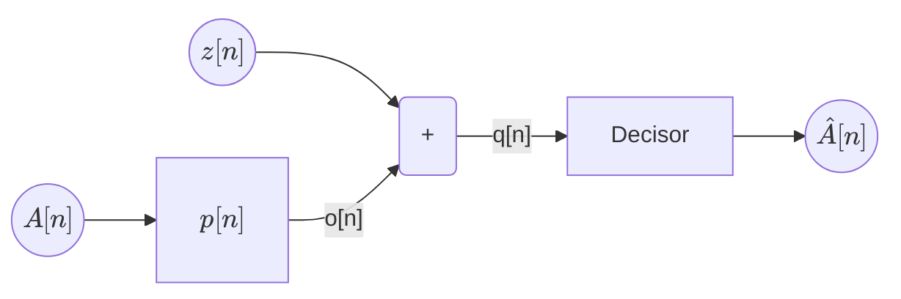

## Exercise 7

A Baseband communication system uses BPSK with $A[n] = ±1$.

$$
g(t) = \begin{cases}
    \frac{1}{\sqrt{T}} & -T/2 < t < 0 \\
    -\frac{1}{\sqrt{T}} & 0 < t < T/2 \\
\end{cases}
$$

The receiver filter is matched to $g(t)$: $f(t) = g(-t)$

The channel filter is $h(t) = δ(t) + δ(t-T/2)$

### 1. Compute $p[n]$

> **Answer**

In order to find $p[n]$, we'll find $p(t)$ first.

$$
\begin{aligned}
    p(t) &= g(t) * h(t) * f(t) \\
    &= g(t) * g(-t) * h(t) \\
    &= α(t) * h(t) \\
\end{aligned}
$$

We'll compute $α(t)$ first. This can be computed graphically to obatain:

$$
α(t) = \begin{cases}
    -1 + \frac{|t|}{T} & \text{if } 0.5 T ≤ |t| ≤ T \\
    1 - 3\frac{|t|}{T} & \text{if } 0 ≤ |t| ≤ 0.5 T \\
    0 & \text{otherwise}
\end{cases}
$$

Now, $p(t)$ can be computed graphically and sampled to obtain $p[n]$.

***

### 2. Is there ISI?

> **Answer**

We only need to take one iteration of the shifted sum to deduce whether or not there is ISI.

Let's take $p(t) = α(t) + α(t - T)$ and sample it at $t = 0$ and $t = T$. We obtain that $p[0] =
0.5$ and $p[T] = -0.5$. This means that there is ISI.

***

### 3. Compute the PSD of $z[n]$

### 4. Find $P_e$

## Exercise ?

2PAM with $p[n] = δ[n] + 0.25 δ[n-1]$. There is white noise characterized by $σ_z^2$

### 1. Is there ISI?

> **Answer**
>
> As $p[n]$ has non-zero values outside of $n = 0$, there is ISI.

### 2. Compute the $P_e$

> **Answer**

First, we'll compute $P_e$ assuming $p[n] = δ[n]$

We'll assume symbols are equally likely, so we'll use the proximity rule:

* $q[n] ≥ 0 ⇒ \hat{A}[n] = 1$
* $q[n] < 0 ⇒ \hat{A}[n] = -1$

Since noise is gaussian, the probability of error is given by:

$$
\begin{aligned}
    P_e &= P(A_n=1) · P(\hat{A}_n=-1 | A_n=1) + P(A_n=-1) · P(\hat{A}_n=1 | A_n=-1) \\
    &= \frac{1}{2} · \left(Q\left(\frac{1}{σ_z}\right) + Q\left(\frac{1}{σ_z}\right)\right) \\
    &= Q\left(\frac{1}{σ_z}\right)
\end{aligned}
$$

However, our $p[n]$ is not a simple delta, so we'll first compute $o[n]$.

$$
o[n] = A[n] * p[n] = A[n] * (δ[n] + 0.25 δ[n-1]) = A[n] + 0.25 A[n-1]
$$

Given all combinations of $A[n]$ and $A[n-1]$, the possible values of $o[n]$ are:

| $A[n]$ | $A[n-1]$ | $o[n]$ |
| :----: | :------: | :----: |
| 1      | 1        | 1.25   |
| 1      | -1       | 0.75   |
| -1     | 1        | -0.75  |
| -1     | -1       | -1.25  |

As we can see, the new constellation now has 4 symbols. Luckily, we can use the same decision
regions as before. We'll now compute the new $P_e$. We'll go case by case:

$$
\begin{aligned}
    P_e |_{A[n]=1} &= Q\left(\frac{0.75}{σ_z}\right) + Q\left(\frac{1.25}{σ_z}\right) \\
    P_e |_{A[n]=-1} &= Q\left(\frac{|-0.75|}{σ_z}\right) + Q\left(\frac{|-1.25|}{σ_z}\right) \\
\end{aligned}
$$

The overall $P_e$ is the average of both cases, as symbols are still assumed to be equally likely.

$$
\begin{aligned}
    P_e &= \frac{1}{2} \left(P_e |_{A[n]=1} + P_e |_{A[n]=-1}\right) \\
    &= Q\left(\frac{0.75}{σ_z}\right) + Q\left(\frac{1.25}{σ_z}\right) \\
\end{aligned}
$$

As we can see, the probability of error is higher than before, when we assumed there was no ISI.
That's why we usually try to avoid ISI like the plague.

***
